<p align="center">
  
</p>

<p align="center">
  <a href="#">
    
  </a>
</p>

<p align="center">
  
  
  
  
  
</p>

<p align="center">
  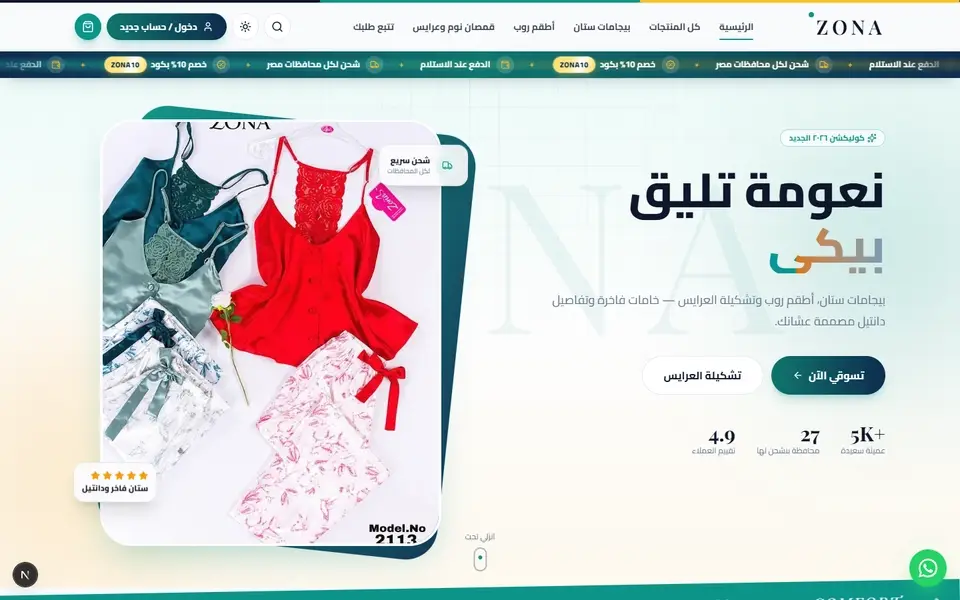
</p>

<div dir="rtl">

## ✨ عن المشروع

**ZONA** متجر أونلاين فاخر للانجري والبيجامات الحريمي، مبني بـ **Next.js 16**، بواجهة عربية كاملة (RTL)، بألوان منصة منارة (تيل `#0d9488` • نيفي `#0e2c4e` • دهبي `#f59e0b`)، ووضع **لايت / دارك**، وأنيميشن في كل سكشن، ولوحة تحكم كاملة للأدمن فيها **CRUD على كل حاجة + حساب الأرباح**.

<p align="center">
  
</p>

## 🛍️ المتجر

| | |
|---|---|
| 🎬 **هيرو متحرك** | صور بتتبدل تلقائي + Parallax + عنوان بيظهر كلمة كلمة |
| 📢 **شريط إعلانات** | Ticker متحرك تحت الهيدر بأيقونات وكود خصم دهبي بيلمع ويقف مع الماوس |
| 🗂️ **الأقسام والمنتجات** | فلترة بالقسم واللون والسعر، بحث، ترتيب، زووم على الصور، ألوان ومقاسات |
| 💍 **بانر العرايس** | Tilt ثلاثي الأبعاد مع الماوس، نجوم دهبي متحركة، نسخ كود الخصم بضغطة |
| 🎥 **ZONA Reels** | فيديوهات المنتجات بتشتغل تلقائي |
| 💬 **آراء العملاء** | صفين بيتحركوا عكس بعض بشكل لا نهائي + متوسط التقييم |
| 🛒 **السلة** | درج جانبي + شريط "فاضلك كام على الشحن المجاني" |
| 🚚 **الدفع والشحن** | سعر شحن لكل محافظة من الـ 27 + كوبونات + كاش / InstaPay / فودافون كاش |
| 📦 **تتبع الطلب** | برقم الطلب والموبايل مع Timeline متحرك |
| 🌗 **لايت / دارك** | تبديل فوري مع رسالة تأكيد |

## 🧑‍💼 لوحة التحكم

| | |
|---|---|
| 📊 **الأرباح** | صافي الربح المحقق والمتوقع، المبيعات، هامش الربح، رسم بياني، حالات الطلبات، الأكثر مبيعًا، المخزون القليل |
| 🧾 **الطلبات** | تغيير الحالة (المخزون بيرجع تلقائي عند الإلغاء)، ربح كل طلب، طباعة فاتورة، واتساب للعميلة |
| 👗 **المنتجات** | رفع صور (تتحول WebP تلقائي) وترتيبها بالسحب، ألوان، مقاسات، تكلفة وسعر وربح القطعة، نسخ منتج |
| 🗂️ **الأقسام • الشحن • الكوبونات • المصروفات • الآراء** | CRUD كامل لكل واحدة |
| ⚙️ **الإعدادات** | نصوص الهيرو وصوره، شريط الإعلانات، أرقام التواصل، السوشيال، الشحن المجاني، طرق الدفع، الفيديوهات |

## 📸 لقطات من الموقع

<table>
  <tr>
    <td align="center"><b>الوضع النهاري</b><br/>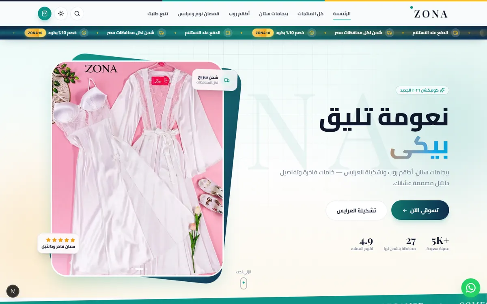</td>
    <td align="center"><b>الوضع الليلي</b><br/>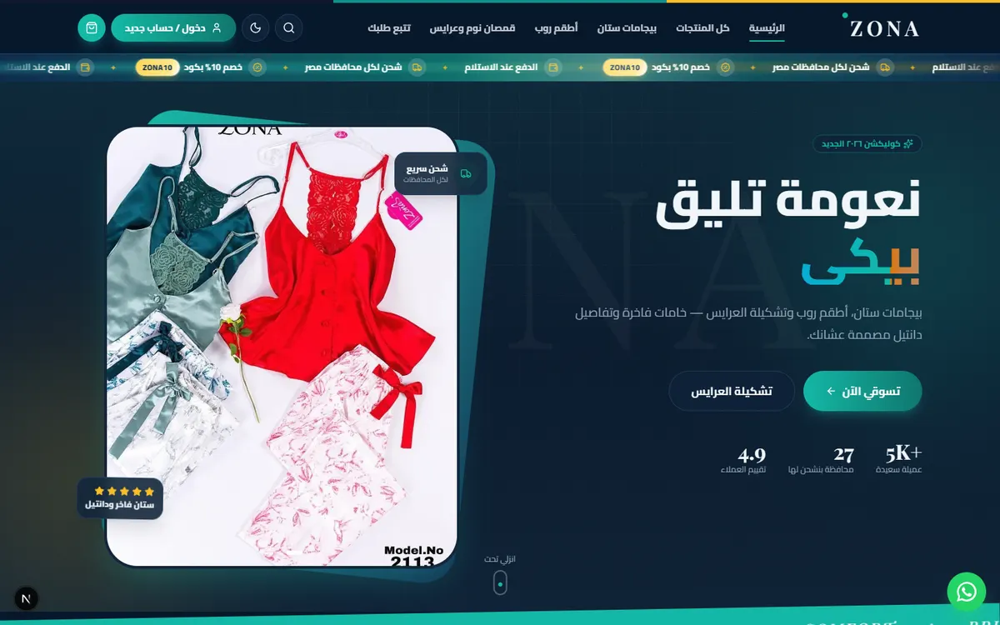</td>
  </tr>
  <tr>
    <td align="center"><b>الأكثر طلبًا</b><br/>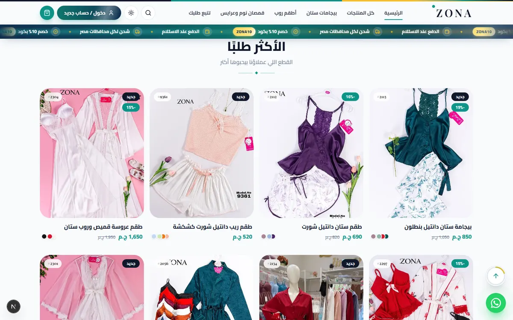</td>
    <td align="center"><b>بانر العرايس</b><br/>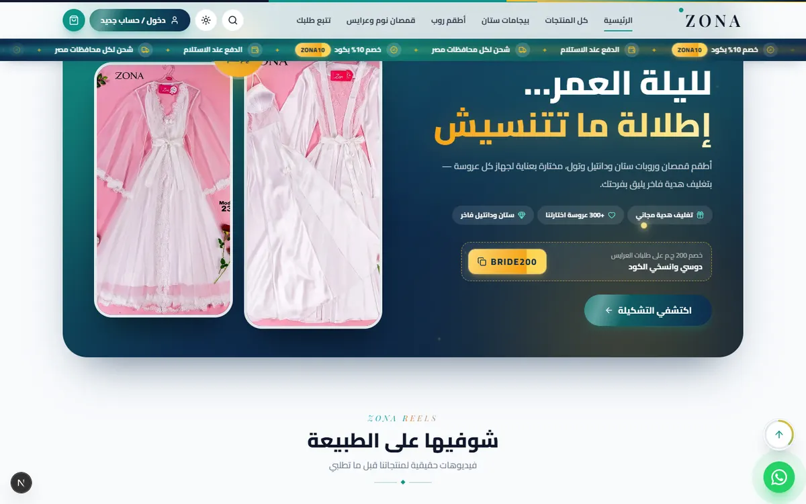</td>
  </tr>
  <tr>
    <td align="center"><b>آراء العملاء</b><br/>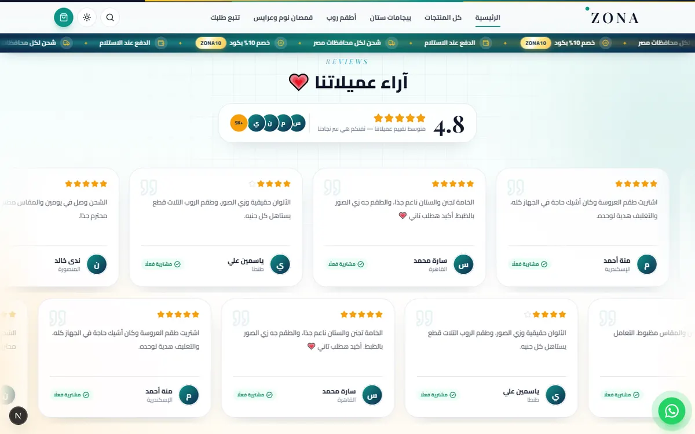</td>
    <td align="center"><b>ليه تختاري ZONA</b><br/>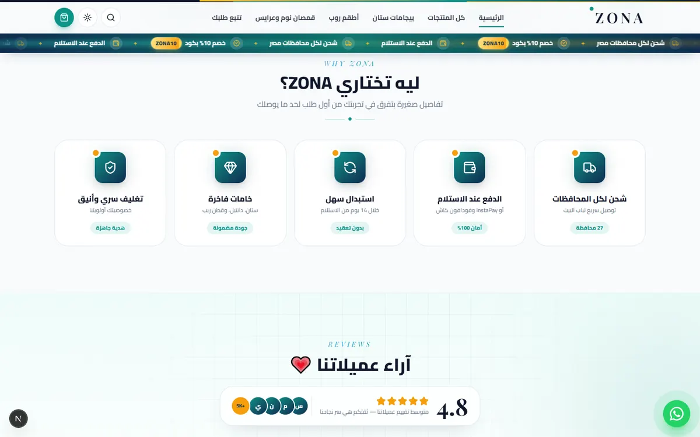</td>
  </tr>
  <tr>
    <td align="center"><b>صفحة المنتج</b><br/>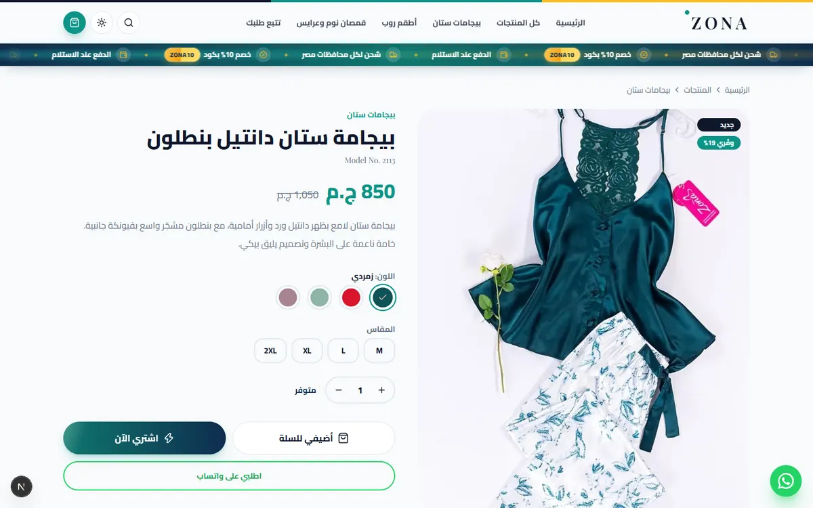</td>
    <td align="center"><b>كل المنتجات</b><br/>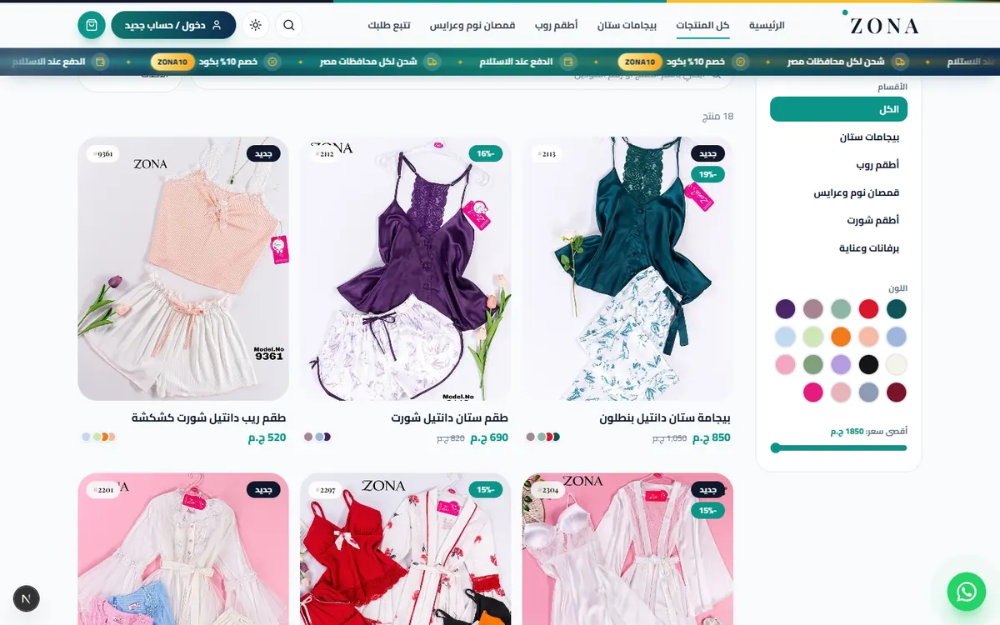</td>
  </tr>
  <tr>
    <td align="center"><b>تتبع الطلب</b><br/>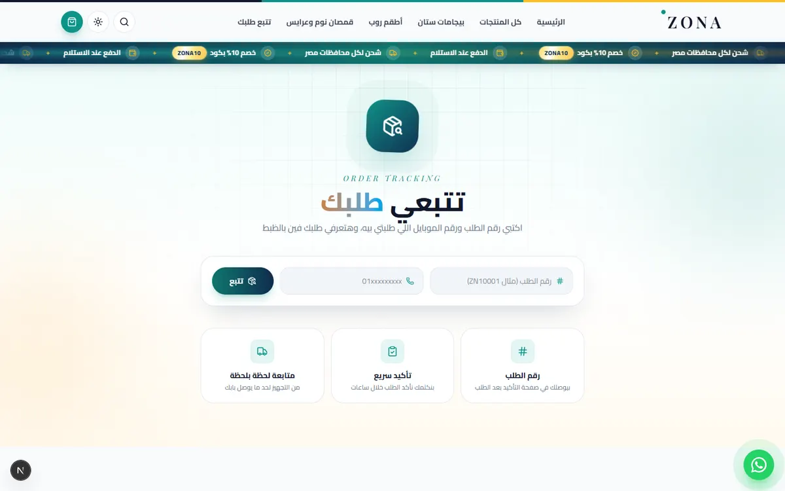</td>
    <td align="center"><b>الفوتر</b><br/>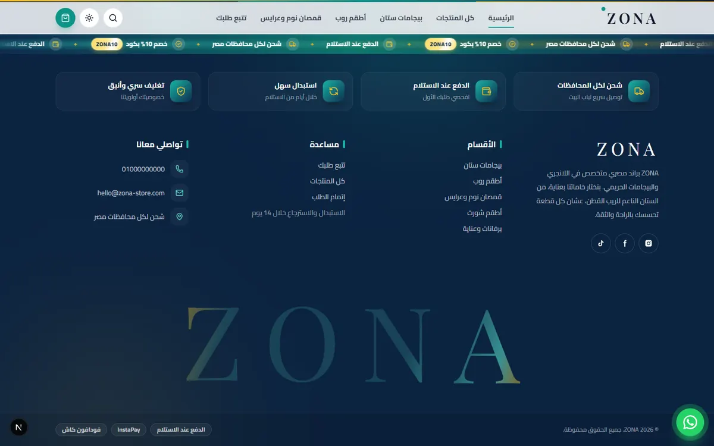</td>
  </tr>
  <tr>
    <td align="center"><b>لوحة الأرباح</b><br/>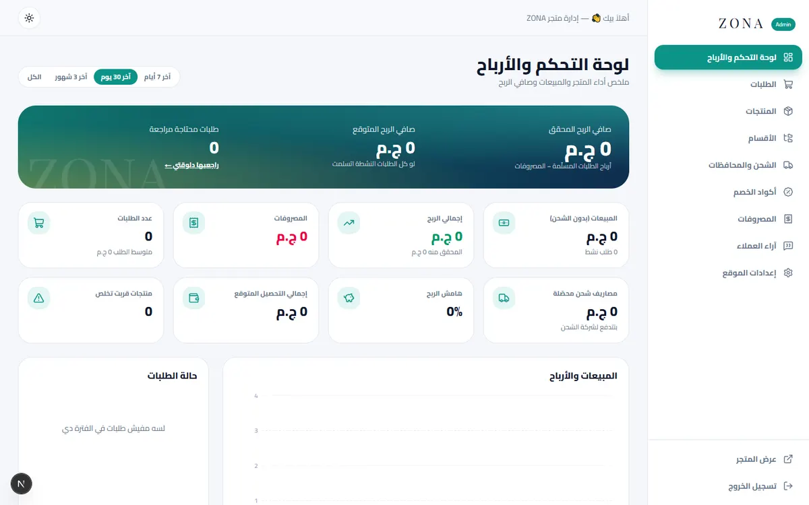</td>
    <td align="center"><b>إدارة المنتجات</b><br/>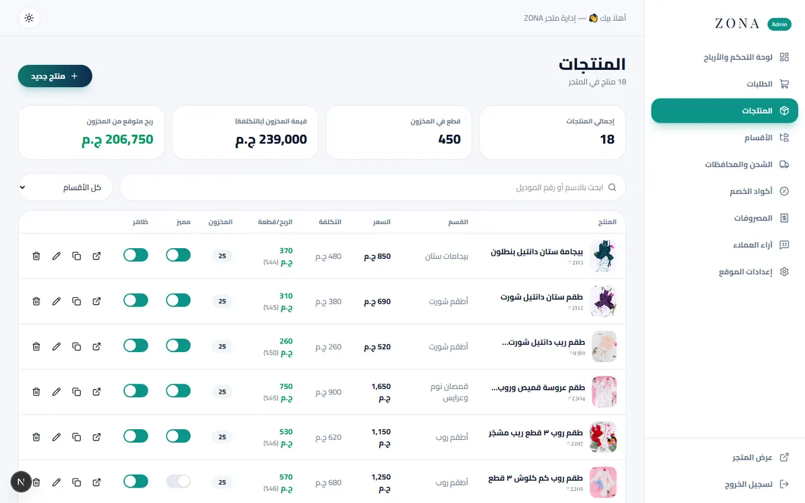</td>
  </tr>
</table>

<p align="center"><b>📱 موبايل</b><br/>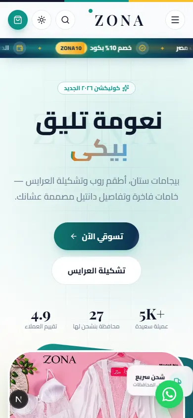</p>

## 🚀 التشغيل

</div>

```bash
npm install
npm run dev                  # http://localhost:3000
npm run build && npm start   # production
```

<div dir="rtl">

### 🔐 لوحة التحكم

- الرابط: `/admin`
- اعمل ملف `.env.local` وحط فيه كلمة السر (**لازم تتغير قبل النشر**):

</div>

```env
ADMIN_PASSWORD=your-strong-password
ADMIN_SECRET=a-long-random-string
```

<div dir="rtl">

### 💾 البيانات

- كل البيانات (منتجات، طلبات، شحن، كوبونات…) في `data/db.json` وبتتعمل تلقائيًا أول تشغيل ببيانات تجريبية.
- الصور المرفوعة من الأدمن في `data/uploads`.
- امسح مجلد `data` عشان ترجع للبيانات الأصلية.
- الاستضافة لازم تكون **سيرفر Node** (VPS / Railway / Render) عشان الملفات تتحفظ.

## 🗂️ هيكل المشروع

</div>

```text
src/
├─ app/
│  ├─ (store)/          # Home, shop, product, checkout, order, track
│  ├─ admin/            # Login + panel (dashboard, orders, products, …)
│  ├─ api/              # Orders, coupons, admin CRUD, upload, login
│  └─ uploads/[file]/   # Serves admin-uploaded images
├─ components/          # Header, ticker, cart, product cards, motion helpers
│  ├─ home/             # Hero, sections, showcase (bridal, features, reviews)
│  └─ admin/            # Shell, CRUD page, dashboard, UI kit
├─ lib/                 # JSON DB, auth (HMAC cookie), orders, seed data
└─ proxy.ts             # Protects /admin/*
```

<p align="center">
  
</p>

<p align="center">
  
</p>
